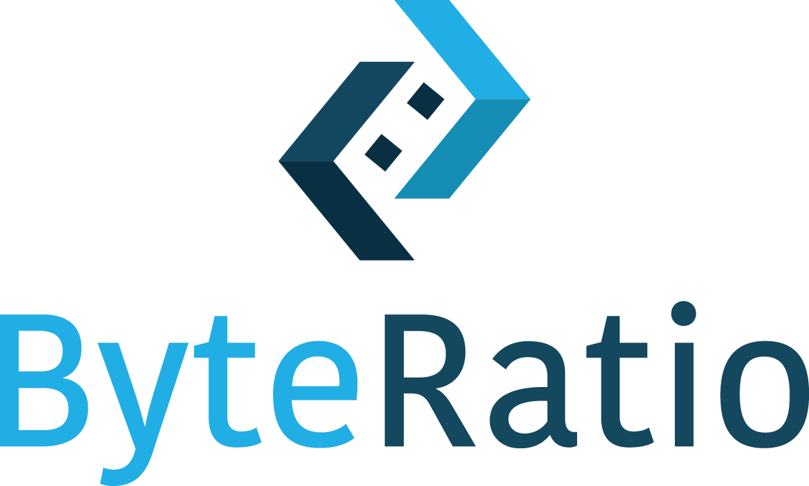

# Creating Docker images for Lambda function use



**Brief Description:**

The target-tracking-auto Lambda function requires a Docker image containing the Selenium Chrome WebDriver, the Python lambda script, and any necessary libraries. This is a short guide on how to create that Docker image and deploy it to AWS Lambda.

**Table of Contents:**

- [Prerequisites](#prerequisites)
- [Usage](#usage)
- [Creating the Docker Image](#docker)
- [Deploying to Lambda](#lambda)
- [Resources](#resources)

### Prerequisites

- AWS CLI installed and configured:
- Docker Desktop:

## Usage

There are three files you will need (at minimum): main.py, Dockerfile, and chrome-installer.sh. The main.py script can be thought of as your Lambda function script. This is the code that will actually get run when the function is triggered. The Dockerfile creates the image with all its dependencies, namely Selenium with ChromeDriver. The chrome-installer.sh script is what gets the latest versions of Chrome and ChromeDriver. Don’t touch it unless you know what you are doing.

**main.py**
```python
import os
import time
from selenium import webdriver
from selenium.webdriver.common.by import By
from selenium.webdriver.common.keys import Keys
from selenium.webdriver.chrome.service import Service
from selenium.webdriver.chrome.options import Options as ChromeOptions
from tempfile import mkdtemp

def lambda_handler(event, context):
    chrome_options = ChromeOptions()
    chrome_options.add_argument("--headless=new")
    chrome_options.add_argument("--no-sandbox")
    chrome_options.add_argument("--disable-dev-shm-usage")
    chrome_options.add_argument("--disable-gpu")
    chrome_options.add_argument("--disable-dev-tools")
    chrome_options.add_argument("--no-zygote")
    chrome_options.add_argument("--single-process")
    chrome_options.add_argument(f"--user-data-dir={mkdtemp()}")
    chrome_options.add_argument(f"--data-path={mkdtemp()}")
    chrome_options.add_argument(f"--disk-cache-dir={mkdtemp()}")
    chrome_options.add_argument("--remote-debugging-pipe")
    chrome_options.add_argument("--verbose")
    chrome_options.add_argument("--log-path=/tmp")
    chrome_options.binary_location = "/opt/chrome/chrome-linux64/chrome"

    service = Service(
        executable_path="/opt/chrome-driver/chromedriver-linux64/chromedriver",
        service_log_path="/tmp/chromedriver.log"
    )

    driver = webdriver.Chrome(
        service=service,
        options=chrome_options
    )

    # Open a webpage
    driver.get('https://www.google.com')

    # Close the WebDriver
    driver.quit()

    return {
        'statusCode': 200,
        'body': 'Success'
    }
```

**Dockerfile**
```
FROM amazon/aws-lambda-python:3.12
# Install chrome dependencies
RUN dnf install -y atk cups-libs gtk3 libXcomposite alsa-lib \
    libXcursor libXdamage libXext libXi libXrandr libXScrnSaver \
    libXtst pango at-spi2-atk libXt xorg-x11-server-Xvfb \
    xorg-x11-xauth dbus-glib dbus-glib-devel nss mesa-libgbm jq unzip
# Copy and run the chrome installer script
COPY ./chrome-installer.sh ./chrome-installer.sh
RUN chmod +x ./chrome-installer.sh
RUN ./chrome-installer.sh
RUN rm ./chrome-installer.sh
# Install selenium
RUN pip install selenium
# Copy the main application code
COPY main.py ./
# Command to run the Lambda function
CMD [ "main.lambda_handler" ]
```

**Chrome Installer**
```
#!/bin/bash
set -e

latest_stable_json="https://googlechromelabs.github.io/chrome-for-testing/last-known-good-versions-with-downloads.json"
# Retrieve the JSON data using curl
json_data=$(curl -s "$latest_stable_json")
latest_chrome_linux_download_url="$(echo "$json_data" | jq -r ".channels.Stable.downloads.chrome[0].url")"
latest_chrome_driver_linux_download_url="$(echo "$json_data" | jq -r ".channels.Stable.downloads.chromedriver[0].url")"
download_path_chrome_linux="/opt/chrome-headless-shell-linux.zip"
download_path_chrome_driver_linux="/opt/chrome-driver-linux.zip"
mkdir -p "/opt/chrome"
curl -Lo $download_path_chrome_linux $latest_chrome_linux_download_url
unzip -q $download_path_chrome_linux -d "/opt/chrome"
rm -rf $download_path_chrome_linux
mkdir -p "/opt/chrome-driver"
curl -Lo $download_path_chrome_driver_linux $latest_chrome_driver_linux_download_url
unzip -q $download_path_chrome_driver_linux -d "/opt/chrome-driver"
rm -rf $download_path_chrome_driver_linux
```

## Docker

Once you’ve created your main.py and added any dependencies to the Dockerfile, you can create an image and push it to AWS.

Important note: you must have Docker Desktop signed in and opened while building the image.

1. Build the docker image
    - docker build --provenance=false -t <build-name> .
2. Tag the docker image
    - docker tag selenium-chrome-driver <your amazon account id>.dkr.ecr.us-east-1.amazonaws.com/docker-images:<name/version>
3. Push the Docker image to AWS ECR
    - aws ecr get-login-password --region us-east-1 | docker login --username AWS --password-stdin <your amazon account id>.dkr.ecr.us-east-1.amazonaws.com/docker-images
    - docker push <your amazon account id>.dkr.ecr.us-east-1.amazonaws.com/docker-images:<name/version>

For <name/version>, the common format is “v1.0.0”.

## Lambda

First, ensure the image appears in ECR. If you followed the instructions above, it should appear in the docker-image directory. Then, while creating a Lambda function, ensure you select “Container image” from the options. You can then select your image. Ensure that the architecture is x84_64. You’re all set!

## Resources

Note: When following the instructions in the source link, be sure to add the “--provenance=false” flag when building the image, otherwise Lambda will not recognize the image.

Written source: https://shillehtek.com/blogs/news/aws-lambda-tutorial-using-selenium-with-chromedriver-in-python?utm_source=youtube&utm_medium=product_shelf
Video source: https://www.youtube.com/watch?v=8XBkm9DD6Ic

**Last Updated:**

July 9, 2025
