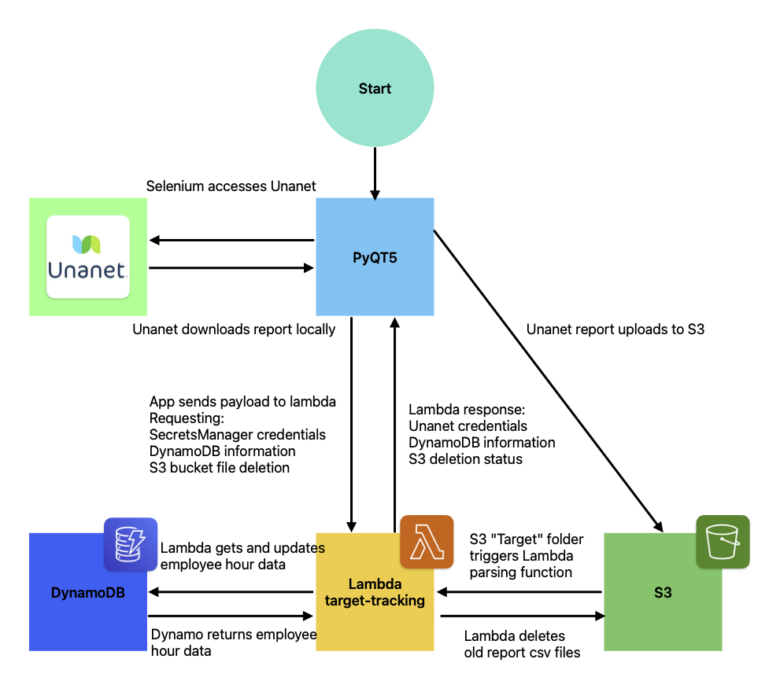
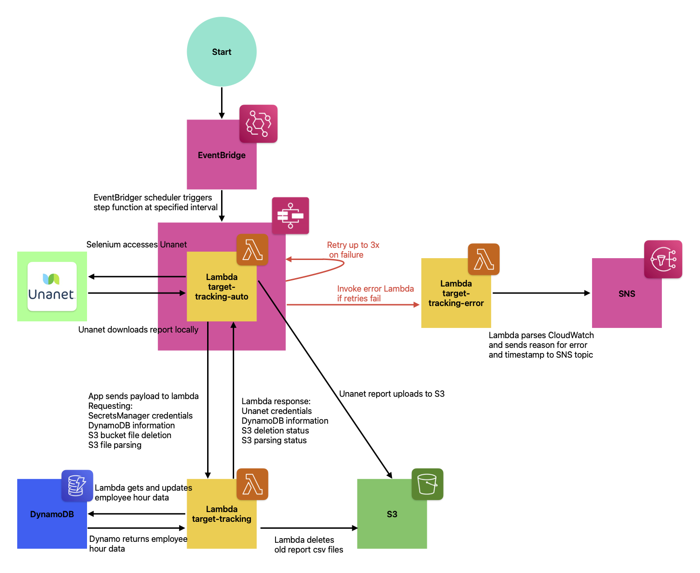
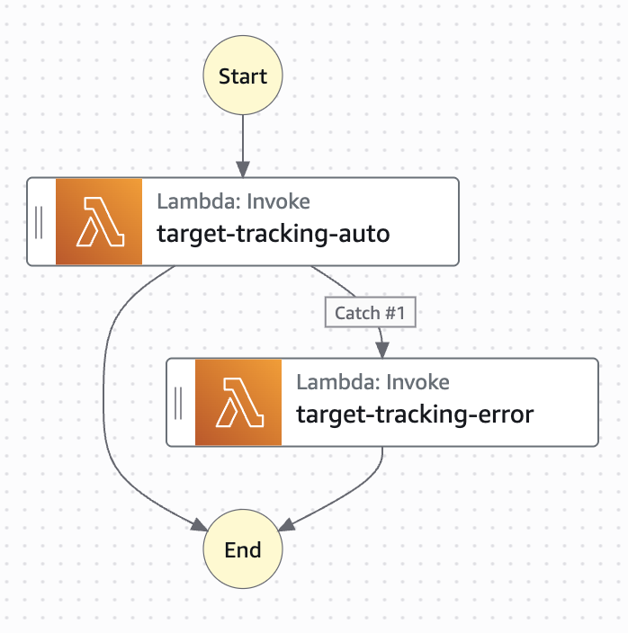

# Target Tracking Backend

**Brief Description:**

This is the backend functionality that generates employee hour reports from Unanet, parses them, and populates DynamoDB for use on the frontend. The backend uses Selenium to automate that report generation process. Then, Lambda functions handle parsing and DynamoDB interactions.

**Table of Contents:**

- [Features](#features)
- [Lambda Functions](lambda)
- [Backend Workflow](#workflow)
- [AWS Resources Used](#resources)
- [Support Information](#support)
- [Contributing](#contributing)

## Features

-   Get direct and indirect hours for a specified week
-   Fix YTD discrepencies when employees modify old timecards
-   Automatically carry out the above actions
-   Notify individuals when errors occur with automated report generation

## Lambda

There are three distinct Lambda functions associated with the backend.

1. The target-tracking Lambda function. This handles the following:
    - Retrieving Unanet credentials held in SecretsManager
    - Parsing Unanet reports
    - Parsing inital target entries
    - Adding, updating, and fetching DynamoDB data
    - Deleting files from S3
2. The target-tracking-auto Lambda function. This handles the following:
    - Generating reports from Unanet for the current pay period
    - Uploading reports to S3
    - Correcting any YTD discrepencies between Unanet and DynamoDB
3. The target-tracking-error Lambda function. This handles the following:
    - Parsing the target-tracking state machine logs on failure
    - Notifying what error occurred through SNS

## Workflow

There are two distinct ways of generating reports from Unanet:
1. Locally
2. Automatically

Below is the workflow of the local application:

The local application can be run at any time. The user will be prompted to provide a username/password which will be sent in a payload to the target-tracking Lambda function. If the combination matches those held in Lamdbda, the Unanet credentials will be returned. The user can then run a report for a given time period, check for YTD discrepencies, or run a full YTD correction. The local application is only interacting with the target-tracking Lambda function through payload requests, or triggering the Lambda function through an upload to the "Reports/" folder in S3.

There is also an automated version of the application. Below is the workflow for the automated application:

The automated application runs on a cron schedule specified in EventBridge (specifically, the target-tracking schedule). This schedule triggers a Step Function state machine (target-tracking) which invokes the target-tracking-auto Lambda function. The state machine process is pictured below:

The reason we use a state machine is so we can retry the Lambda function on failure, and go to a "fail state" when the retries fail. This "fail state" triggers the target-tracking-error Lambda function, which can then notify specified individuals that an error occurred.

There are two notable differences between the local and automatic applications. First, the target-tracking-auto Lambda function is not a traditional Lambda function with space to write code. All of the code is held in a Docker image alongside the Chrome WebDriver and necessary libraries. This requires creating a Docker image and deploying the Lambda function with an image. The details of this are specified in the DockerFiles folder. Second, the target-tracking Lambda function is only triggered by file uploads to the "Reports/" and "Targets/" folders. All other operations are done through direct invocations, including informing the function there was an upload to the "Auto/" folder when reports are generated automatically.

## Resources

In total, nine distinct AWS resources are used in the backend. They are:
1. Lambda
    - target-tracking
    - target-tracking-auto
    - target-tracking-error
2. DynamoDB
    - target-tracking-concrete
    - target-tracking-hypothetical
3. S3
    - target-tracking-selenium
        - "Auto/", reports generated from the automated app
        - "Reports/", reports generated from the local app
        - "Targets/", initial target entry information
4. Step Functions (State machines)
    - target-tracking
5. Cloudwatch
6. Simple Notification Service (SNS)
    - target-tracking-error
7. SecretsManager
    - target-tracking-unanet-login
8. Elastic Container Registry (ECR)
    - docker-images repo
9. EventBridge
    - target-tracking

## Support

This section aims to explain some choices that spread between the different Lambda functions and scripts that in-line comments might otherwise fail to explain.

**1. Conflicts with Microsoft and Unanet**

All Microsoft accounts are created with an employee's legal name (e.g. Michael Example). In Unanet, however, they can be either a legal name or a trade name (e.g. Mike Example). We use FirstLastYear as the key for database information, since this is the only information we can pull from Unanet. Because of this, we need to account for the name discrepencies between the two services. Our solution was to have the backend keep a dictionary of employees with multiple names, and use their legal name when inserting into the database. This dictionary is kept in DynamoDB under the ID "names". All target-tracking functions that insert into DynamoDB will first compare an employee's ID to the dictionary to see if they have a name discrepency. If they do, we change their ID to the Microsoft name before inserting. Similarly, when getting the DynamoYTD, we reverse their ID to the Unanet name before returning the dictionary of YTD values.

**2. Starting from Ground Zero**

If the need ever arises to completely reset the database and start from ground zero, there are two important steps that must be completed for the backend to reflect accurate data.

First, the Unanet / Microsoft name discrepency file must be uploaded to the "Names/" folder in S3. There is a trigger for the target-tracking function that will parse this file and upload the necessary information to DynamoDB.

Second, the initial list of targets must be uploaded to the "Targets/" folder in S3. The target-tracking lambda function will automatically parse this information and reflect in DynamoDB.

**3. File Structures**

For the Unanet / Microsoft name file and the initial targets file, there is a specific format needed in order for the backend to properly parse the data. Examples are located in "tt-backend/ExampleFiles".

Important note: if an employee is "pro-rated", there must be a start date formated similar to DD/MM/YY in the description. If this does not exist, we cannot properly determine their target information. There should otherwise not be a description.

**4. How Reports are Generated**

For both the local and automated report generation scripts, the period for YTD report generation is the week prior to the current week. This means it will generate from January 1st to the Friday of last week. Similarly, the automated script will generate reports weekly for the previous week. There exists logic when generating at the beginning of the year to differentiate between the current year and last year's information (meaning, if 1/1 falls on a Wednesday it will run two reports, one for the first half of the week and one for the second half).

Important note: The logic for when to end the report generation will go backwards from the day before the current date until it finds the first Friday. This is done so that, if you're testing on a Friday, it does not generate a report for the current week when it should be generating for the previous week.

## Contributing

Any backend contributions require updates to the Lambda functions themselves. There is currently no automation for this process. To update the automated Lambda function, you must follow the instructions for creating a Docker image and deploy the new image to the target-tracking-auto Lambda function. To update the local application, you should make changes to the local script and deploy where necessary. Both of these updates may require updating the target-tracking Lambda function.

**Last Updated:**

July 18, 2025
