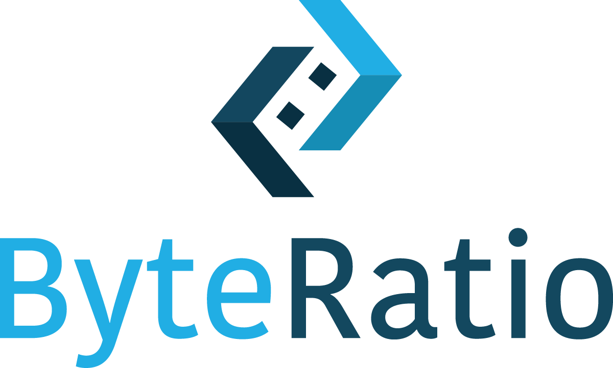

# Target Tracking Frontend



**Brief Description:**

This is the frontend for the Target Tracking application. This is what allows employees, team leads, and admins to access information on yearly target hours, leave time, vacation planning, and more. It does not interact directly with the backend, but instead pulls the information generated by it from DynamoDB. The application is hosted on Vercel.

**Table of Contents:**

- [Features](#features)
- [Technologies Used](#technologies)
- [Requirements](#requirements)
- [Installation](#installation)
- [Support Information](#support)
- [Contributing](#contributing)

## Features

-   Employees can access information on their:
    - Remaining Leave Hours
    - Hours Remaining to Reach Target
    - Mid and End Goal
        - Target
        - Pacing
        - Total Hours
        - Avg Hours Needed to Hit Target
    - Request Target Change
- Team leads have additional access to:
    - Team Employees Search
    - Team Dashboard Displaying:
        - Total Employees in Team
        - Mid and End Year Goals Met
        - Breakdown of Employee Distance from Goal
    - Overview of Team Employees Hours
- Admins have access to:
    - All Employees Search
    - All Employees Dashboard Displaying:
        - Total Employees in Team
        - Mid and End Year Goals Met
        - Breakdown of Employee Distance from Goal
    - Ability to Change Target Hours
    - Overview of All Employees Hours

## Technologies

The frontend uses NextJS, a React Framework. It also interacts with:
- Microsoft Entra ID for authentication
- Microsoft Graph for roles / team membership information
- DynamoDB for database access
- SNS for target change notification

## Requirements

You will need Node.js version 18.18.0 or later. Instructions on how to install it are here: https://nodejs.org/en/download

For automatic deployment to Vercel, you will also need to request access to the target-tracking project within the ByteRatio team in Vercel.

## Installation

**1. Clone the repo**
```bash
git clone https://github.com/ByteRatioDev/br-2025-intern-project.git
cd tt-frontend
```
**2. Install dependencies**
```
npm install
```

**3. Run the dev server**
```
npm run dev
```

**4. Run the build**
After contributing, this must run cleanly:
```
npm run build
```

## Support

This project has a lot of interconnected parts that may be confusing or hard to follow. This section aims to explain the reasoning behind some of the choices that were made during development.

**1. Conflicts with Microsoft and Unanet**
All Microsoft accounts are created with an employee's legal name (e.g. Michael Example). In Unanet, however, they can be either a legal name or a trade name (e.g. Mike Example). We use FirstLastYear as the key for database information, since this is the only information we can pull from Unanet. Because of this, we need to account for the name discrepencies between the two services. Our solution was to have the backend keep a dictionary of employees with multiple names, and use their legal name when inserting into the database. When returning information to the backend applications, we reverse this process (since we would only use said information to compare to Unanet reports). In summary, if an employee is listed in the dictionary, we use their legal name found there. If not, we proceed with the name given by Unanet.

**2. Authentication**
The frontend application uses 5 different files to complete the authentication process. They are:
- src/app/lib/auth.ts
    - This is the central config and initialization point
- src/app/lib/fetchGroups.ts
    - Get the group the employee belongs to (employee, team lead, admin)
- src/app/lib/fetchMembers.ts
    - Get the employees that belong to a team lead
- src/app/lib/routes.ts
    - Specify which routes / pages each user can access
- src/middleware.ts
    - Acts as a gatekeeper, intercepting requests and enabling redirects where necessary

**3. Table vs Calendar View**
In the Leave Plannig page there are two views: calendar and table. The data inputs can be saved for both of these. However, changing data on one input will not effect the other. This is done intentionally. Having talked to users of the application, it was understood that they would likely be using one or the other, not both. Additionally, if they were to use both, they would like each to be separate since they would be planning differently on each. Lastly, there is no way of knowing which day an employee is taking off when going from table view to calendar view, so at best we would be approximating their leave day.

**4. Roles**
There are three distinct roles an employee can be assigned to: employee, team lead, or admin. Everyone starts as an employee. In Microsoft they can be assigned the role of team lead or admin. Team lead would be for, you guessed it, team leads and their team members would be assigned in Microsoft as well. Admin would be Linda / Jamie's view of employee data. These roles must be assigned by Jamie and there is currently no automated procedure for this.

**5. Environment Variables**
There are several environment variables that need to be configured in order for the application to work. These are already deployed in Vercel. To run the application locally, you should follow the format in tt-frontend/env-example.

## Contributing

Contributions can be made directly to GitHub. 

```bash
git add .
git commit -m "Commit message"
git push origin main
```

All pushes / merges to the main branch will automatically deploy to Vercel. For this reason it is very important to run ```npm run build``` before merging anything with the main branch. If that command fails, the deployment to Vercel will also fail.

Note: This is only true if your GitHub account is linked to the ByteRatio team and target-tracking project in Vercel. Otherwise, pushes to main will not be deployed to main and you will have to manually deploy from Vercel.

**Last Updated:**

July 9, 2025